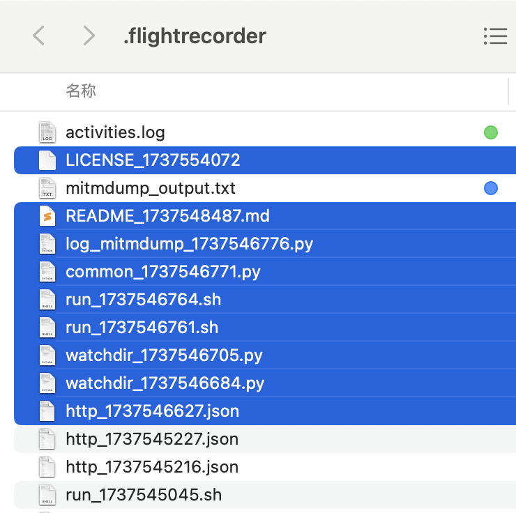
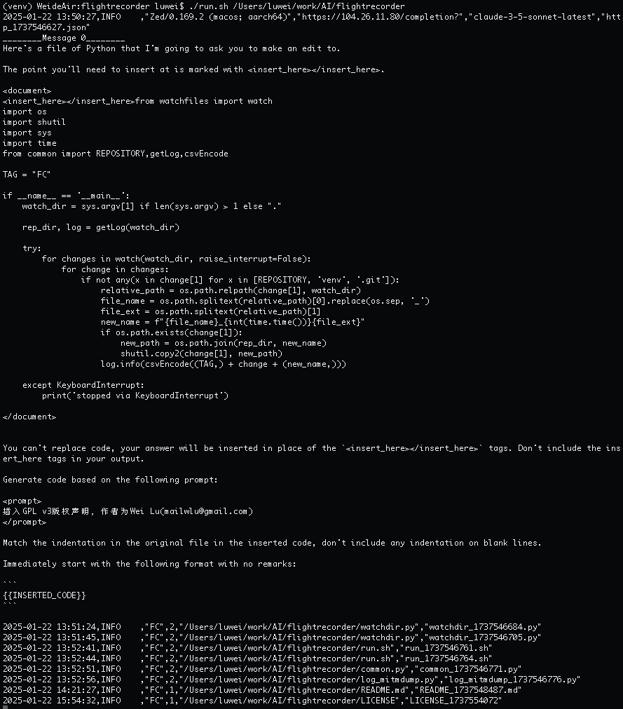

# Flight Recorder ("black box") for your AI Copiloting 

An open-source, product-neutral approach to record all file modifications within the selected working directory, along with requests to online AI models (including prompts) and their responses from selected applications like IDEs, code editors or browsers. 

Check [this article](https://medium.com/@GenerationAI/making-a-black-box-for-ai-code-generation-a55d7720be44) for more ideas.

## Usage

### MacOS
Install [mitmproxy](https://mitmproxy.org)
```bash
brew install mitmproxy
sudo security add-trusted-cert -d -p ssl -p basic -k /Library/Keychains/System.keychain ~/.mitmproxy/mitmproxy-ca-cert.pem
```
After completing a series of authorizations, you should be able to see "Mitmproxy Redirector" added in "Applications".

git clone this repo.
```bash
cd flightrecorder
```

setup virtual environment in your favourite way with python 3.11 (as I'm using. modern versions of Python 3 should work as well) and install the dependencies.

```bash
pip install -r requirements.txt
```

[Zed](https://zed.dev) is used in the example, you can edit **mitmproxy --mode local:"<ins>App Name</ins>"** in script *run.sh* with the name of your Editor or IDE, or [intercept more traffic with other modes](https://docs.mitmproxy.org/stable/concepts-modes/). 
```bash
./run.sh <path of working dir>
```
When you run the script, any file operations in the working directory, as well as AI API calls made by the Editor/IDE, will be recorded in its *.flightrecorder* subdirectory.



The *activities.log* file (tagged green) serves as a chronological log of all events. Each line is a CSV-formatted record, with most fields being self-explanatory. The 3rd and 4th columns, labeled “FC”,1/2/3 indicate file modification operations with the following numerical codes:

1: A new file was added.

2: A file was modified.

3: A file was deleted.

The HTTP requests made during model calls contain detailed information, such as the user’s input instructions, how tools like IDEs append context to construct the final LLM prompt, and the server’s response. These details are stored in *http_&lt;timestamp&gt;.json* files.

For all file operations, copies of the files—both before and after modifications—are saved with their original filenames appended by a timestamp.

In addition to writing these logs and data to files, the *run.sh* example script also provides more human-readable output to the console, making it easier to follow the recorded activities in real time.



In the screenshots, the last column of each log entry corresponds to the files saved in the *.flightrecorder* data folder (highlighted in blue). The file labeled with a blue tag, *mitmdump_output.txt*, contains a comprehensive record of all network communication data, including HTTP and other protocols.
